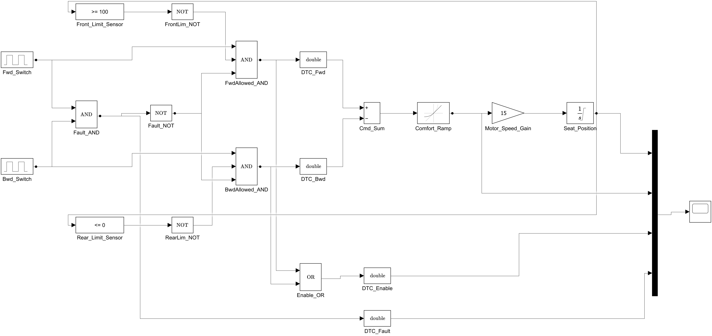
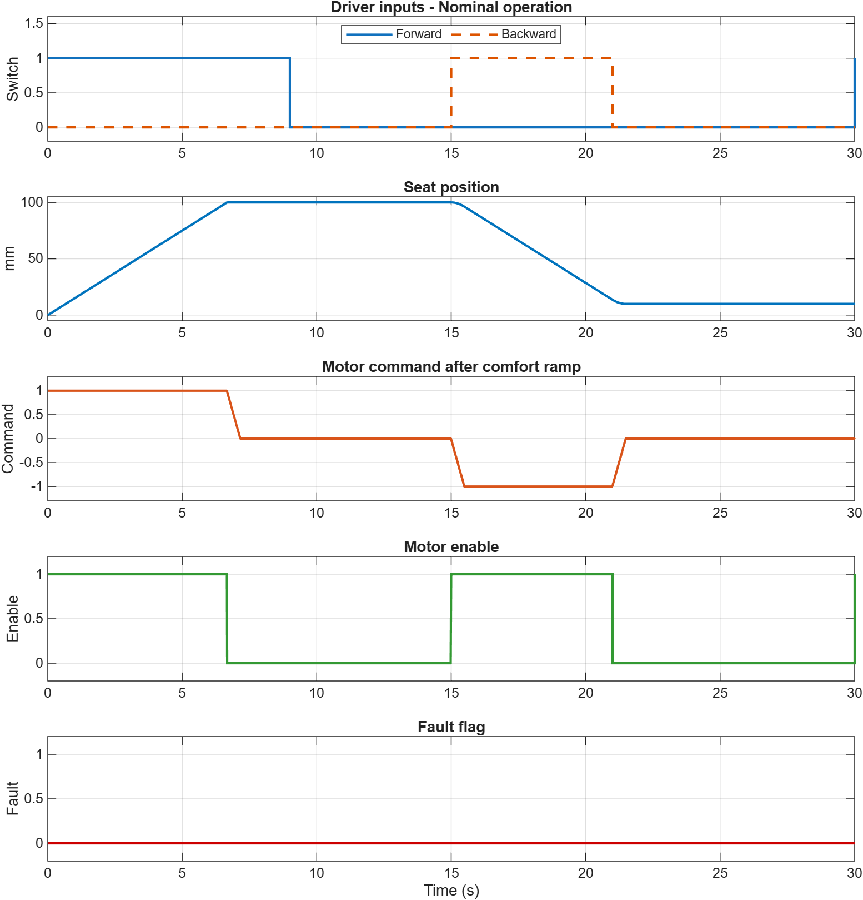
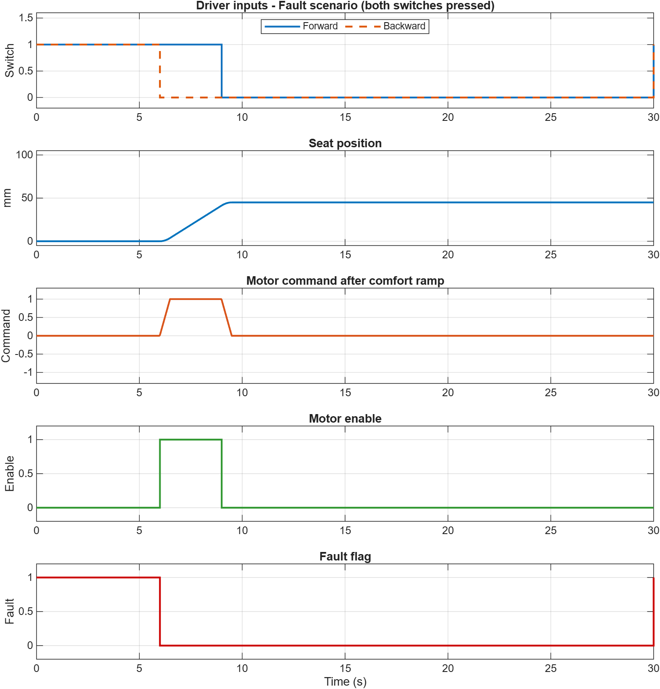

# Seat Control System (SCS) Edge Controller - MATLAB/Simulink Simulation

Simulink model of a one-axis automotive power seat controller with forward/backward drive, front and rear limit switches, a fault interlock (both switches pressed = motor disabled) and a comfort ramp (rate limiter) for smooth start and stop. The controller runs on a fixed 10 ms step.

**Author:** Amith John Koshy (25BEC0091)

## Files

| File | Description |
|------|-------------|
| `seat_control_scs_model.m` | Builds, saves and simulates the `SeatControlSCS` model |
| `test_seat_control_scs.m` | Assertion-based verification (tests T1 to T4) |
| `generate_figures.m` | Exports the block diagram and result plots to `figures/` |
| `SeatControlSCS.slx` | Simulink model (R2025a format) |
| `SeatControlSCS_Report.pdf` / `.docx` | Project report |

## How to run

In MATLAB, set the current folder to this repository, then run:

```matlab
seat_control_scs_model   % build and simulate; open the Scope to view signals
test_seat_control_scs    % run verification tests
generate_figures         % regenerate figures
```

## Key parameters

| Parameter | Value |
|-----------|-------|
| Travel range | 0 to 100 mm |
| Speed gain | 15 mm/s at full command |
| Comfort ramp slew rate | +/- 2 units/s |
| Solver | ode4, fixed step 0.01 s |
| Stop time | 30 s |

## Results



| Nominal operation | Fault interlock |
|---|---|
|  |  |

All verification tests pass: seat position stays within 0 to 100 mm, the fault flag is raised exactly when both switches are pressed, and the motor command never exceeds the configured slew rate.
